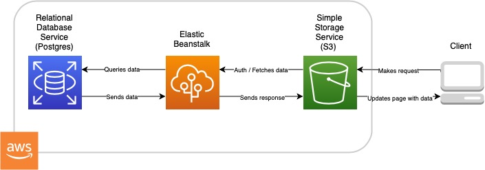

# Udagram Infrastructure

Udagram is hosted on AWS and uses the following services:
- Relational Database Service (RDS)
	- Postres database for storing users and their posts
- Elastic Beanstalk
	- For hosting Node.js backend API
- Simple Storage Service (S3)
	- For hosting frontend application

## Application Flow
The general flow of the application is fairly simple:
1. The client makes a request to the frontend application
2. The frontend application fetches data from the backend API when needed
3. The backend application queries data from the database
4. The database send data to the backend application
5. The backend application sends a response with payload to the frontend application
6. The frontend application updates the page with new data

## User Authentication
User authentication is handled by the backend application using JSON Web Token.
