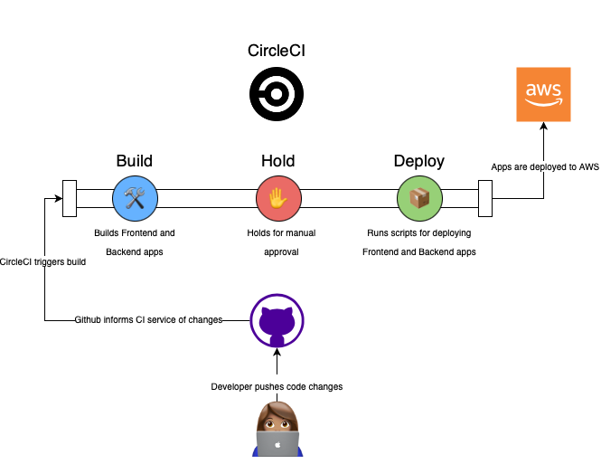

# Udagram Pipeline

Udagram uses CircleCI for its CI/CD pipeline. Current, the pipeline only has a few steps:
- ***Build***
	- Builds both the frontend and backend applications
- ***Hold***
	- Pauses pipeline for manual approval before deployment
- ***Deploy***
	- Run scripts for deploying applications to AWS

All of these actions will be triggered if there are changes in the ***master*** branch of the repository.

